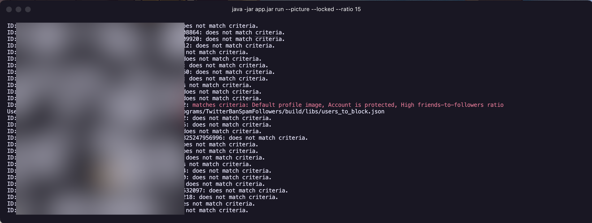
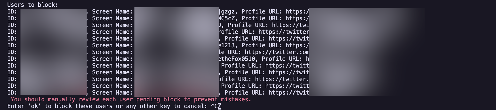

# TwitterBanSpamFollowers

#### 欢迎使用 TwitterBanSpamFollowers 应用程序！

#### 此工具将通过一定的规则Block用户，提高互动质量。减少各种广告、无意义账号的关注以及机器账号的监视。

## 🛠️ 安装

首先，确保您的机器上已安装 Java。您可以从 [Oracle](https://www.oracle.com/java/technologies/javase-jdk11-downloads.html)
下载，或者使用您喜欢的包管理器，例如：

### **Homebrew：**

```bash
brew install openjdk
```

### **APT：**

```bash
sudo apt update
sudo apt install openjdk-21-jdk
```

### **YUM：**

```bash
sudo yum install java-21-openjdk-devel
```

### **Pacman：**

```bash
sudo pacman -S jdk21-openjdk
```

## 🚀 快速开始

### 1. **Twitter 进行身份验证：**

首先，运行以下命令以使用 Twitter 进行身份验证：

   ```bash
   java -jar app.jar auth
   ```

这将弹出一个链接，用它打开一个网页，您可以在其中登录到您的 Twitter 帐户并输入提供的 PIN 码。

此过程将在您的目录中生成一个`twitter_credentials.properties` 文件。

### 2. **Run命令：**

例如，要Block**同时**使用默认个人资料图片、在过去 3 个月内注册且关注者与被关注者比例大于 20:1 的用户，请使用以下命令：

   ```bash
   java -jar app.jar run --picture --register 3 --ratio 20
   ```

要查看运行命令的所有可用选项，请使用：

   ```bash
    java -jar app.jar run --help
   ```

这将显示可用的用法和选项，您可以将它们组合使用。注意，无论您使用了一个还是多个flag，都是在*同时满足*的情况下才会判断为Block。

   ```bash
    Usage: <FileName.jar> run [<options>]

    Block them now!

    Options:
      --access-token=<key>   OAuth access token
      --access-secret=<key>  OAuth access token secret
      --dry-run              Print destructive actions instead of performing them
      --picture              Block users with default profile pictures
      --register=<int>       Block users registered within the specified number of months
      --spam=<int>           Block users with 0 fans but too many followings
      --locked               Block users who have protected their tweets
      --include-site         Also scan the user's website link
      --include-location     Also scan the user's location string
      --delay=<int>          Delay between fetching two users must be specified in milliseconds. A high delay can significantly extend the processing time, but it will make the process more stable. Note that 1 second equals 1000 milliseconds. The default value is 100 milliseconds, and it must be greater than 80 milliseconds.
      --ratio=<int>          Block users with a followings-to-followers ratio higher than the specified value
      -h, --help             Show this message and exit

   ```

**若命令后跟随`<int>`则代表需要跟随数字，如`--ratio=<int> `，需要使用`--ratio 5`等。**

其中`--access-token=<key>`和`--access-secret=<key>`已经在**Twitter 进行身份验证**步骤获得，将根据目录下的缓存文件
`twitter_credentials.properties`读取，不需要额外指定。

### 2.1 推荐参数

由于错误的Block人是一件麻烦的事。使用以下推荐方案可以减少这种情况。

1. 使用*同时满足*使用默认头像、3个月内注册、关注数与粉丝比例大于20的。这种情况下可以排除绝大多数正常人。
   ```bash
   java -jar app.jar run --picture --register 3 --ratio 20
   ```
2. 使用*同时满足*使用默认头像、锁推、关注数与粉丝比例大于20的。这种情况下也可以排除绝大多数正常人。
   ```bash
   java -jar app.jar run --picture --locked --ratio 20
   ```

### 3. **Execute命令：**

由于众多因素如

1. 网络不稳定导致无法完全运行，那么就先屏蔽已经扫描出来的吧
2. 粉丝数太多，不想等那么久，Run命令跑一会就不想等了，那么就先屏蔽已经扫描出来的吧

等原因，你可能会用到这个命令。

此命令将根据 `users_to_block.json` 文件开始Block其中的用户。

```bash
java -jar app.jar execute
```

## <span style="color:red">特别提示：您有义务在执行最终Block前进行手动的检查，确认每一位用户是否真的需要被Block，而不是仅靠程序代工。由于您的疏忽导致的任何后果与作者无关。</span>

## ⚙️ 配置

### **0.检查哪里的关键词？**

默认情况下，会检查用户的`screenName`，即昵称。以及`description`，即用户简介。

当然，在启用了` --include-location`或（和）` --include-site `的时候，也会相应的检查用户地址栏以及用户网站栏填写的内容。

### **1.内置敏感词**

程序内置了敏感词列表。文件源于[sensitive-word项目](https://github.com/houbb/sensitive-word)
的 [中文敏感词字典](https://github.com/houbb/sensitive-word/blob/master/src/main/resources/sensitive_word_dict.txt)。存储在
`src/main/resources/sensitive_word_dict.txt`路径下。您可以根据您的喜好更换、添加、删改。

### **2.用户敏感词**

您可以在程序内置的敏感词列表的基础上设置用户敏感词。它在当前目录下的`blocking_rules.json`文件中定义。下面是它的默认格式：

```json
{
    "userKeywords": [],
    "excludeKeywords": []
}
```

顾名思义，`userKeywords`就是您要在内置敏感词的基础上额外新加的敏感词列表,`excludeKeywords`
则是排除项。有时候，并不能根据设置的敏感词很好的区分一个人是否需要block，
`excludeKeywords`则在这时候派上了用场。

例如，在假设内置敏感词文件中**没有**`crypto`这一项。那么，在如下设置中，就会考虑block包含敏感词`crypto`的人。但是假设他同时又包含关键词
`男高`，则不会被block。

```json
{
    "userKeywords": [
        "crypto"
    ],
    "excludeKeywords": [
        "男高"
    ]
}
```

最终结果是，所有包含`crypto`的人都会被block，**但是包含`男高`的那部分例外。**

## ✨运行截图

### 1.判断过程

#### 判断过程中，若有符合要求的，会有红字提示、并列举原因。



### 2.Block过程

#### Block过程中，会提示ID、用户名、账号、主页链接。有确认步骤。



## ❓Q&A环节到了

### Q1. 运行过程中总出现TwitterException/SSLHandshakeException/EOFException/没有对所有用户都进行判断就进入了Block环节

#### A1. 这是推特原因，没有能*根治*的方法。但是可以得到一定缓解。以下供参考：

1. 选择更稳定的网络连接。网络波动会导致程序不按预期运行。
2. 鉴于多数人都是用VPN，可以考虑等一会儿再试试，也许你这会儿梯子并不稳定。有时候20个就停止了，有时候2000个也能正常运行。
3. 使用`--delay`参数设置延迟时间。一般100为宜(默认值)，小于80容易出现Rate Limit的问题，过大会导致运行时*显著增长*
   。该值为毫秒。若设置为200，有3000粉丝，不考虑网络传输以及判断逻辑等耗时，需要耗费600秒(10分钟)在等待上。

### Q2. 为什么内置屏蔽词基本上都是屏蔽键政、黄推、币圈、Web3？

#### A2. 说什么呢我的朋友，不B这些B谁啊？你可以选择更换字典或者设置排除词汇，当然了，你也可以选择不用。

### Q3. 编译过程Gradle报错了

#### A3. 是的。但是不影响编译，仍然能编译Jar出来，作者等有时间改（嗯），，。要是能帮忙康康提PR那感激不尽捏呜呜呜，，，

### Q4. 你怎么把API公开发出来了！！这不是收费的吗？

#### A4. 没错，API是明文存储而且开源的发出来了。但是这是Twitter官方Mac客户端内部的API，谷歌一下，你也能搜到（）既然推特都漏成筛子了，也不差我这点捏。

## 🤔 使用出现问题?

- 提issue就行，记得*务必*带上报错截图和*准确的描述*你做了什么，方便我定位。不然复现不出来的话我没办法解决。
- 不会提issue也没关系，给我的[telegram](t.me/killua_chatbot)或者[twitter](twitter.com/killuadev_kt)发私信就可以了，要求同上。